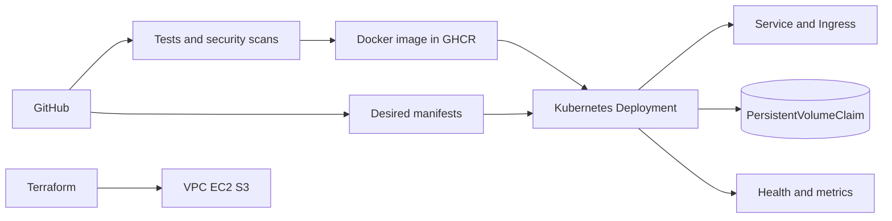

# Final DevOps project: Task Board

**Arka Ghosh · Enrollment 10110 · GitHub Godatcode**

The application is a small HTTP task board. It stores tasks in SQLite, has unit tests, and exposes readiness, liveness, and Prometheus metrics. The repository connects it to Docker, GitHub Actions, Kubernetes, Helm, Terraform, monitoring, and a GitOps workflow. Source is in [`application`](application), Dockerfile in [`docker`](docker), manifests in [`kubernetes`](kubernetes), chart in [`helm`](helm), Terraform references in [`terraform`](terraform), security notes in [`security`](security), monitoring in [`monitoring`](monitoring), and GitOps in [`gitops`](gitops).



## Run locally

```bash
cd application
python3 -m unittest -v
python3 app.py
# Another terminal:
curl http://localhost:8080/healthz
curl http://localhost:8080/metrics
curl http://localhost:8080/api/tasks
```

For Docker, from this directory: `docker build -f docker/Dockerfile -t board:local .` and `docker run --rm -p 18086:8080 -e APP_TITLE='DevOps Task Board' board:local`. The page is at `http://localhost:18086/`.

## Kubernetes and Helm

Create a real `board-secret` outside Git, then apply ConfigMap, PVC, Deployment, Service, HPA, and Ingress from `kubernetes/`. A running Ingress controller and Metrics Server are needed for Ingress and HPA. The Deployment uses one replica and `Recreate` with a ReadWriteOnce SQLite PVC. `helm lint helm` and `helm template board helm` check the chart before installing. The chart's `emptyDir` loses tasks on Pod replacement and is intended for the Helm rollout lab.

## Pipeline and security

The GitHub Actions workflow tests source, scans for secrets and vulnerable/misconfigured files, builds an image, scans the image, then publishes to GHCR if the gates pass. A real cluster deploy requires a protected credential and approval and is not embedded in the push workflow. The Secret example is a placeholder; real token values stay out of Git. The container runs without root and the Kubernetes manifest limits resources and privileges.

## Infrastructure, monitoring, and GitOps

[Terraform Session 18](../session-18-terraform-iac/README.md) covers S3, while [Session 19](../session-19-cloud-terraform/README.md) covers VPC, subnet, EC2, and S3. The app exposes `/metrics` and health endpoints; `kubectl logs` gives request logs. The GitOps design keeps manifests in Git for a controller to reconcile after one is configured.

## Troubleshooting exercise

1. Change the image tag to a nonexistent value. `kubectl describe pod` should show pull errors. Restore the image and check `kubectl rollout status deployment/board`.
2. Change the Service selector to `app: wrong`. `kubectl get endpoints board` should show no backend. Restore `app: board` and test via port forwarding.
3. Remove the Secret before rollout. Pod events should show the missing Secret. Recreate it outside Git and check readiness.

The Service selector scenario was run on the local cluster. Its before and after results are in the [cluster verification](../CLUSTER_VERIFICATION.md).

## Lessons learned

I found that the data model affects deployment strategy: a single SQLite file means one replica and a persistent volume, whereas a multi-replica HPA needs a shared database. I also found that a manifest or workflow is only the desired configuration; the evidence is the test, build, scan, or cluster output after execution.

## Local verification (7 October 2026)

All three unit tests passed. The Docker image built successfully. A running container returned `ok` from `/healthz`, `board_tasks_total 0` from `/metrics`, and `[]` from `/api/tasks`.

The [local Kubernetes verification](../CLUSTER_VERIFICATION.md) also records the live Deployment, PVC persistence, Helm rollback, and Service troubleshooting checks.
