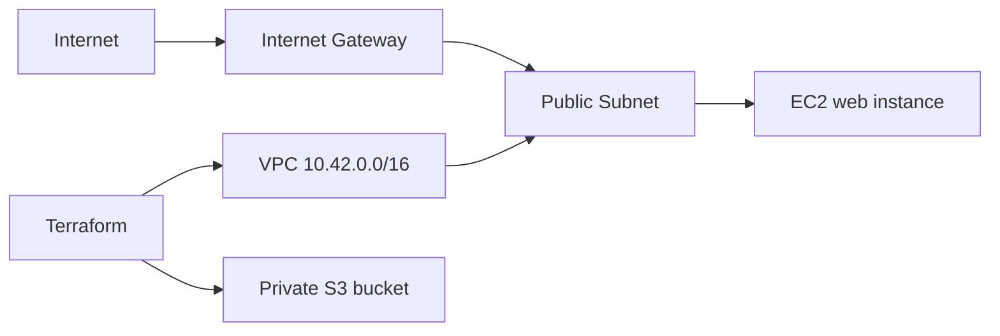

# Session 19: Cloud and Terraform in action

This project defines an AWS VPC, public subnet, internet gateway, route table, web security group, EC2 instance, and private S3 bucket. Terraform references connect the resources: the subnet uses the VPC ID, EC2 uses the subnet and security group IDs, and the route table uses the gateway ID. Outputs expose the instance and bucket identifiers. Terraform state records the last known real resources and must be protected.

Create `terraform.tfvars` from the example and choose a unique bucket name. Run `terraform init`, `terraform fmt`, `terraform validate`, `terraform plan`, then `terraform apply` only with an AWS account and approval for possible charges. Verify with `terraform show` and `terraform output`, then `terraform destroy` to remove lab resources. No cloud resources are claimed as live from this machine.

## Validation result

Terraform 1.9.8 completed `terraform init -backend=false`, `terraform fmt -check`, and `terraform validate` successfully on 7 October 2026. This checks configuration syntax and provider schema; it does not prove live AWS provisioning.
